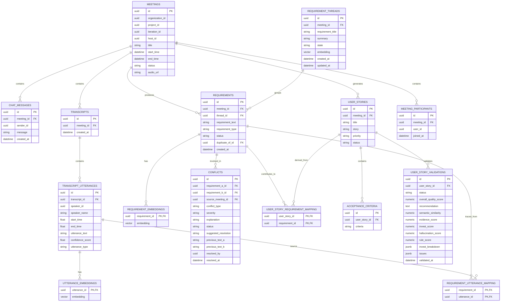

# Intelligent User Story Generator Service

This service parses transcripts from collaborative agile meetings, extracts requirements, manages BA conflict resolution, and generates validated agile user stories using advanced LLM reasoning and retrieval-augmented generation (RAG).

## Architecture & Tech Stack
- **Framework**: FastAPI (Python)
- **Database**: Neon Cloud PostgreSQL (with `pgvector` for embedding storage)
- **Vector Search**: pgvector & ChromaDB (for transcript retrieval)
- **Transcription**: Azure Cognitive Services Speech SDK (Real-time WebSockets & batch parsing)
- **Security**: JWT-based Authentication (integrated with Auth Service)

The project follows clean architecture principles:
- `src/api/` — API Routes (speech and pipeline) & middlewares.
- `src/core/` — Settings configuration and logging.
- `src/db/` — Database gateway (PostgreSQL, ChromaDB) and init files.
- `src/models/` — Domain data models (Pydantic).
- `src/repositories/` — Repository abstractions for persistent data.
- `src/services/` — Internal services (Speech client, RAG utilities, User Story validation engine).
- `src/prompts/` — Grounded prompt templates.
- `src/pipeline/` — Pipeline execution models.

---

## Getting Started

### Prerequisites
- Python 3.10+
- Neon Cloud PostgreSQL instance
- API Keys: Azure Speech Key, LLM API Key (OpenRouter/Gemini), and Auth JWT Secret

### 1. Setup Environment
Copy the example environment file and fill in your keys:
```bash
cp .env.example .env
```
Ensure you set your Neon PostgreSQL credentials:
```ini
# PostgreSQL (Neon Cloud)
DATABASE_URL=postgresql://neondb_owner:<password>@<neon-host>/meeting_db?sslmode=require&channel_binding=require
DB_HOST=<neon-host>
DB_PORT=5432
DB_USER=neondb_owner
DB_PASSWORD=<password>
DB_NAME=meeting_db
DB_SSLMODE=require
```

### 2. Apply Database Schema
Since Neon is a cloud database, apply the SQL schema to initialize the tables:
- **Neon Dashboard**: Go to the SQL Editor in your Neon console, paste the contents of `src/db/initialize/init.sql`, and click **Run**.
- **CLI (optional)**:
  ```bash
  psql "postgresql://neondb_owner:<password>@<neon-host>/meeting_db?sslmode=require" -f src/db/initialize/init.sql
  ```

### 3. Run the Service (Local Development)
Install dependencies and run Uvicorn:
```bash
pip install -r requirements.txt
uvicorn src.main:app --host 0.0.0.0 --port 8001 --reload
```
The API docs will be available at `http://localhost:8001/docs`.

### 4. Run using Docker Compose
The `docker-compose.yml` runs only the application container. The database connects directly to your Neon instance.
```bash
docker-compose up --build
```

---

## Database Schema



---

## API Routes Documentation

### 1. Speech & Meeting Orchestration (`/api/v1/speech`)
- `POST /meeting/create` — Create an instant meeting. Resolves current project iteration context via Auth Service.
- `POST /meeting/join` — Join a room using `meeting_id` and passcode.
- `GET /meeting/{meeting_id}/chats` — Retrieve text messages exchanged in the room.
- `GET /meeting/{meeting_id}/transcript` — Retrieve transcript captions (either memory-buffered or Postgres fallback).
- `POST /meeting/{meeting_id}/finalize` — Finalize raw transcription, execute sentence tokenization, mapping, vector indexing, and close room.
- `GET /meeting/{meeting_id}/requirements` — Retrieve extracted requirement threads and items.
- `GET /meeting/{meeting_id}/conflicts` — Retrieve requirements conflicts.
- `POST /meeting/{meeting_id}/conflicts/{conflict_id}/resolve` — Resolve a specific requirement conflict.
- `GET /project/{project_id}/conflicts` — Retrieve all requirement conflicts across meetings for a project.
- `GET /project/{project_id}/iteration/stories` — Fetch all user stories linked to the active iteration of a project.
- `WS /ws/{meeting_id}` — WebSocket voice & transcription endpoint.

### 2. User Story Generation (`/api/v1/pipeline`)
- `POST /run` — Generate stories directly from a given transcript request body.
- `POST /upload` — Upload a `.txt` transcript file, generate a virtual meeting linked to the current active iteration, and ingest.
- `POST /generate-from-requirements` — Ingest active requirement details and output agile stories.
- `POST /user-stories/{story_id}/update` — Update manual changes to a story and trigger 5-layer backend re-validation.
- `POST /user-stories/{story_id}/status` — BA manual override endpoint to mark a story as Approved, Rejected, or Reset.
