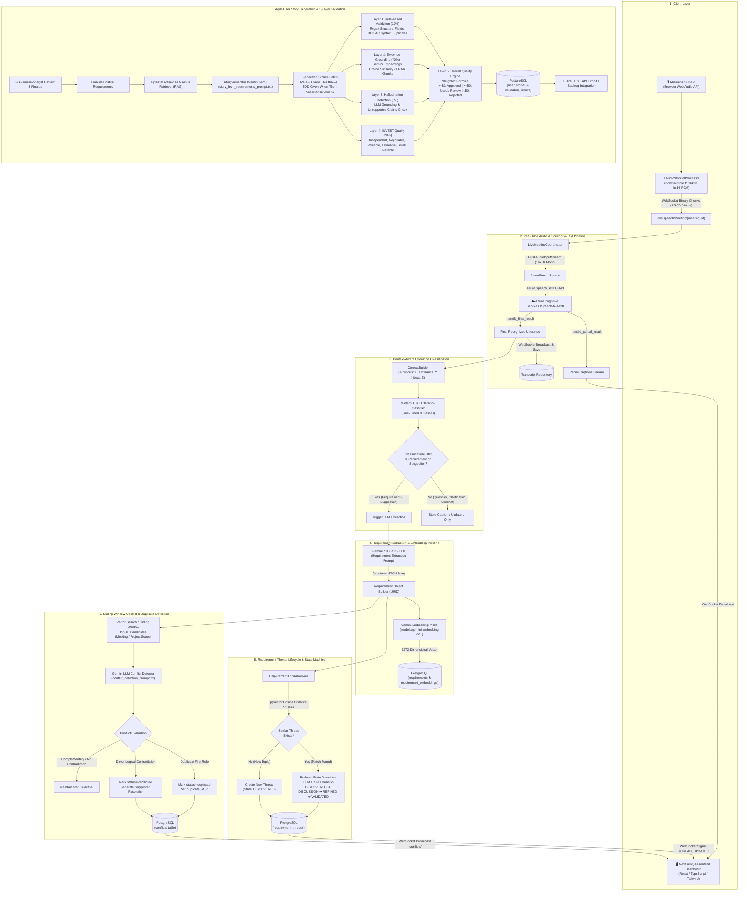
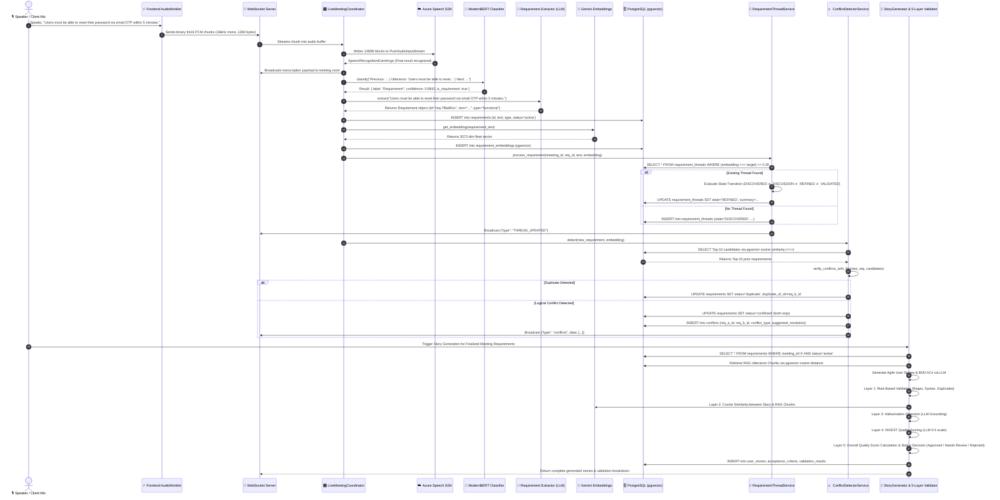
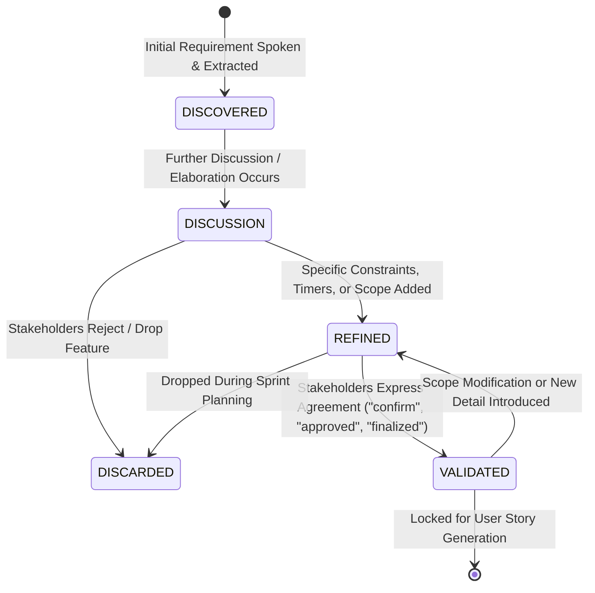
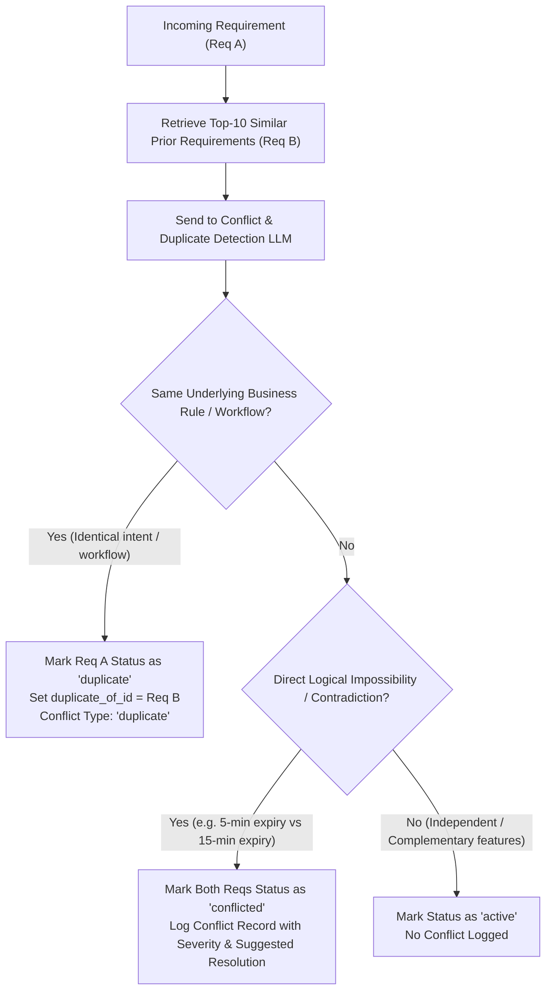

# Intelligent User Story Generation Service
## Complete End-to-End Architecture & Data Flow Specification

---

## 1. High-Level System Architecture Overview



---

## 2. Detailed End-to-End Sequence Diagram



---

## 3. Requirement Thread Lifecycle State Machine



---

## 4. Conflict vs. Duplicate Decision Matrix



---

## 5. Step-by-Step Sample Data Payloads

### Step 1: Voice Streaming Ingestion Payload
```json
{
  "event": "azure_final_transcription",
  "data": {
    "text": "Users must be able to reset their password via email OTP within 5 minutes.",
    "speaker_id": "conn-9b1deb4d-3b7d-4bad-9bdd-2b0d7b3dcb6d",
    "speaker_name": "Kasun (Lead BA)",
    "is_final": true,
    "timestamp_start": 12.4,
    "timestamp_end": 16.8
  }
}
```

### Step 2: ModernBERT Classification Output
```json
{
  "input_context": "Previous: We need a secure way for users who forget credentials. | Utterance: Users must be able to reset their password via email OTP within 5 minutes. | Next: Yes, that sounds good.",
  "label": "Requirement",
  "confidence": 0.9842,
  "is_requirement": true
}
```

### Step 3: Extracted Requirement & Vector Embedding
```json
{
  "requirement_id": "req-7f8a9b1c-1234-4567-89ab-cdef01234567",
  "meeting_id": "meet-c83b92d1-921a-4932-8411-ae932145bc89",
  "requirement_text": "The system shall send a 6-digit OTP to the user's registered email with a 5-minute expiration time for password reset.",
  "requirement_type": "functional",
  "status": "active",
  "embedding_sample": [0.0241, -0.0153, 0.0892, 0.0041, 0.0318]
}
```

### Step 4: Requirement Thread State Machine
```json
{
  "thread_id": "th-550e8400-e29b-41d4-a716-446655440000",
  "title": "Email OTP Password Reset",
  "summary": "Users receive a 6-digit OTP via email expiring in 5 minutes. Rate-limited to 3 attempts.",
  "state": "REFINED",
  "linked_requirements": ["req-7f8a9b1c-1234-4567-89ab-cdef01234567"]
}
```

### Step 5: Conflict & Duplicate Detection Result
```json
{
  "conflict_id": "conf-4a2b1c3d-9999-8888-7777-666655554444",
  "requirement_a_id": "req-7f8a9b1c-1234-4567-89ab-cdef01234567",
  "requirement_b_id": "req-999a888b-1111-2222-3333-444455556666",
  "conflict_type": "temporal",
  "severity": "high",
  "explanation": "Requirement A mandates a 5-minute OTP expiry window, whereas Requirement B mandates a 15-minute expiry window for password reset.",
  "suggested_resolution": "The system shall send a 6-digit OTP for password reset that expires after 10 minutes, balancing security and user convenience.",
  "status": "active"
}
```

### Step 6: Generated Agile User Story & BDD Acceptance Criteria
```json
{
  "story_id": "US-101",
  "title": "Password Reset via Email OTP",
  "story": "As a registered customer, I want to reset my password using a time-limited email OTP, so that I can securely regain access to my account if I forget my credentials.",
  "acceptance_criteria": [
    "Given a registered user is on the forgot password page, When they submit their valid registered email, Then a 6-digit OTP is sent to their email with a 5-minute expiration timestamp.",
    "Given the user received an OTP, When they enter the correct 6-digit OTP within 5 minutes, Then they are redirected to the set new password screen.",
    "Given an OTP was sent more than 5 minutes ago, When the user enters the expired OTP, Then an error message 'OTP has expired. Please request a new code.' is displayed.",
    "Given a user enters an incorrect OTP 3 consecutive times, When the 3rd attempt fails, Then the OTP session is locked for 15 minutes."
  ],
  "priority": "Must",
  "confidence": 0.95,
  "status": "ready",
  "evidence_refs": ["req-7f8a9b1c-1234-4567-89ab-cdef01234567"]
}
```

### Step 7: 5-Layer Validation Scores & Approval
```json
{
  "story_id": "US-101",
  "rule_score": 100.0,
  "semantic_similarity": 0.8924,
  "evidence_score": 89.24,
  "hallucination_score": 0.02,
  "invest_score": 4.75,
  "invest_breakdown": {
    "Independent": 0.95,
    "Negotiable": 0.90,
    "Valuable": 1.00,
    "Estimable": 0.95,
    "Small": 0.95,
    "Testable": 1.00,
    "overall": 0.95
  },
  "overall_quality_score": 90.12,
  "status": "Approved",
  "issues": [],
  "recommendation": "User story is validated and ready for the product backlog."
}
```

---

## 6. Mathematical Formula for 5-Layer Quality Score

$$\text{Overall Score} = (0.40 \times \text{Evidence}) + (0.25 \times \text{Semantic}) + (0.20 \times \text{INVEST}) + (0.10 \times \text{Rule}) + (0.05 \times (1 - \text{Hallucination}))$$

| Layer | Component | Weight | Target Metric |
| :--- | :--- | :---: | :--- |
| **Layer 1** | **Rule-Based Validation** | **10%** | Regex story structure, non-empty fields, BDD GWT syntax, no duplicate titles (0–100) |
| **Layer 2** | **Evidence Grounding** | **40%** | Max cosine similarity between Story embedding and RAG Transcript Chunks (0–100) |
| **Layer 3** | **Hallucination Detection** | **5%** | Gemini LLM claim grounding assessment ($0.0 = \text{clean}, 1.0 = \text{hallucinated}$) |
| **Layer 4** | **INVEST Quality Scoring** | **20%** | Independent, Negotiable, Valuable, Estimable, Small, Testable (Normalised to 0–100) |
| **Layer 5** | **Overall Decision Threshold** | **Final** | $\ge 80.0 \implies \mathbf{Approved}$<br>$\ge 50.0 \implies \mathbf{Needs\ Review}$<br>$< 50.0 \implies \mathbf{Rejected}$ |
