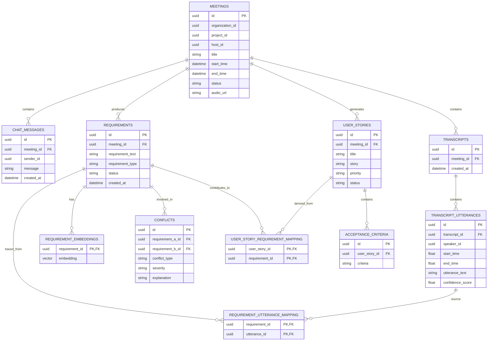

# API Documentation

This directory contains the Postman collection for testing the **Intelligent Voice Parser Service**.

## Postman Collection
The file `postman_collection.json` can be imported directly into Postman.

### Setup
1. **Import**: Open Postman -> Import -> Select `postman_collection.json`.
2. **Variables**: The collection uses the following variables:
   - `base_url`: Defaults to `http://localhost:8001` (Voice Service).
   - `auth_token`: Your Auth Service JWT. You must set this in the collection variables or environment.
   - `meeting_id`: Used for meeting-specific requests.
   - `passcode`: Used for joining meetings.

### Key Features
- **Meeting Orchestration**: Create and join virtual rooms for collaboration.
- **Real-time Transcription**: Live voice-to-text via AssemblyAI WebSockets.
- **Persistent Chat**: Send and retrieve messages that stay linked to the meeting.
- **AI Analysis**: Generate summaries and action items from meeting data.

### Authentication
Every request (except health) requires an `Authorization: Bearer <token>` header. This token must be a valid JWT issued by the **Auth Service** (Port 8000).

### WebSocket Connection
Connect to `ws://localhost:8001/ws/{{meeting_id}}?name={{your_name}}` for real-time audio and chat streaming.

## Database Schema

The service uses a normalized PostgreSQL database with `pgvector` for embeddings.



## Getting Started

### 1. Database Setup
The service requires a PostgreSQL database with the `pgvector` extension.
```bash
cd agile-meeting-db-setup
docker-compose up -d --build
```

### 2. Environment Variables
Ensure you have a `.env` file configured in the root directory (refer to `.env.example`). Key variables include:
- `DB_*_TABLE` naming conventions
- `AZURE_SPEECH_KEY` and `AZURE_SPEECH_REGION`
- `LLM_API_KEY` and `CHAT_MODEL`
- `AUTH_SECRET` for JWT validation

### 3. Run the Service
Install dependencies and run the FastAPI server:
```bash
pip install -r requirements.txt
python main.py
```
The service will start on `http://localhost:8001`. You can access the Swagger UI documentation and test endpoints at `http://localhost:8001/docs`.
